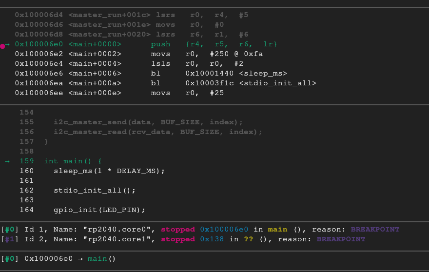

# Intro 
This is a showcase of the things I learned working with microcontrollers. The code I wrote, the debugging, dumping and reversing of the firmware. There isn't any cool hacking in this one :(

The program I wrote in C is for the Pico MCU that communicates with UART and I2C using their SDK library. Unfortunately I didn't have an I2C peripheral and so I am treating the host device as both a master and slave.
I am also using a second Pico as a debugprobe. You can easily set it up by following the instructions in the getting started with Pico pdf [Appendix A](https://datasheets.raspberrypi.com/pico/getting-started-with-pico.pdf )


The program just takes user input through UART and stores it through I2C.

Let's try to debug it, dump it and reverse it's firmware.

# Build
```bash
mkdir build; cd build
cmake ..
cmake --build . -- -j $(nproc)
```
And to flash it to the target, connect the target while pressing the BOOTSEL button and copy the uf2 file from the build directory

Now that we got that out of the way, lets check it out!
Connect the picoprobe (in my case the second Pico that acts as picoprobe) to a computer, open minicom, or GNU screen, or whatever you fancy and then connect the target device to the PC.
``` bash
minicom -D /dev/ttyACM0
```

As we can see we are prompted for a message to insert. Then it writes it to the I2C slave, storing it, and then reads it out to us.


Nothing fancy. Pretty simple and straight forward.

# Logic
Let's use a Logic Analyzer to see the I2C communication in action.
For this I am using the Saleae logic software.

After connecting the cables we can start the intercept right before sending the message.
Once we capture the signals we can stop and zoom in to it. We ll also need to set up the I2C analysis setting so the software so it can interpret the signals appropriately.


Using the hex representation we can see the slave address is `0x17`


Notice the 0 before the message, that's because of the logic of the program. we need to tell the slave the index it should start writing to. The rest are null bytes because the buffer it sends is of fixed size every time.

# OpenOCD
With the debugprobe we can debug the device through SWD and using OpenOCD
```
sudo openocd -f interface/cmsis-dap.cfg -f target/rp2040.cfg
```
This binds a debugger on the port 3333 for remote debugging and telnet on port 4444 to send various commands.
In a second window we can connect to the telnet and look at the flash banks.
```
telnet localhost 4444
reset init
flash banks
```

From the [Datasheet](https://datasheets.raspberrypi.com/rp2040/rp2040-datasheet.pdf) for Pico we know that the user firmware is stored in an external memory that starts from `0x10000000`. Since we don't know how large the firmware is, we know that 2MB is the limit.

We know the start address and we have a large enough number to include the whole firmware. With that we know enough to dump it!
```
dump_image fw.bin 0x10000000 0x200000
```


Since we are requesting for 2MB this will take a while. We could speed up the process by trying out a smaller size and hope that's still large enough to include the whole firmware.
We could of course cheat and check the size of the `.bin` file in the build directory, but if you want to dump the firmware it's probably because you don't already have it.


If we wanted to flash a new firmware instead (let's say if we patched the extracted firmware) we can do so using the convenient `programmer` in our telnet window that automates the process of flashing.

```
reset init
program i2c.bin verify reset 0x10000000
```

# Reversing
Now that we have the firmware let's try to analyze it.

We ll use Ghidra for that, but we need to do a bit of a setup first to give some context to Ghidra about the binary.

We know the start address of the flash memory, the size and we know that Pico uses a Cortex CPU. With that we can open it by pressing the cute dragon button, but there's still more setting up left to do. 


In the memory layout we can tweak things out further to help Ghidra analyze things better.
From the datasheet again we know that the start address for the RAM is at `0x20000000`.
Also the first 0xFF bytes in the flash is various metadata and the actual `.text` starts at `0x10000100`


With all that we can finally start the analysis.


The firmware starts (excluding the metadata) with the Vector Table. 
Since it's ARM, that means that its x32.
The first 4 bytes initialize the top of the stack.
The next 4 bytes (word) will have to be the Reset_Handler, so let's take a loot at that address (keep in mind that the addresses here have their least significant bit set to 1, so the actual address will be `0x100010f6`).


The reset handler is like the entry from regular binaries. Does some setup and calls the main function, which means we can find the location of the main function from there.


In this case the main function is at the address `0x100006e0`


# Debug
Now that we know the address of the main function let's check out the actual debugger on port 3333 and set a breakpoint in main.

Depending on your Operating System you might need to use multiarch or some other tool. For Arch we run this command to start our debugging.
```
arm-none-eabi-gdb build/i2c.elf --eval-command="gef-remote localhost 3333"
```

Keep in mind that I am using GEF with my GDB. GEF by default should fail.
Looking up the error online I came across a github issue and their solution was to replace the registers in the gef.py script from `cpsr` to `xpsr` in the `ARM` class. See for [reference](https://github.com/hugsy/gef/issues/320 )

With that, the context command is less broken.

We will need to reset the execution. We can either run `reset init` on the telnet, or unplug and re-plug the target.

```
b *0x100006e0
```

Once we reach the breakpoint we can see the main.



