# Overview
My attempt to hack the TL-WR841N V14 from Tp-link.
This isn't by any means exhaustive and there are still a lot more things you can do to further exploit it.

At an overview we managed to:
- Gather OSINT
- Connect via unrestricted/unauthenticated UART
- Upload and download files
- Dump the firmware
- Analyse it locally on our computer

## Contents
- [OSINT](#OSINT)
- [UART](#UART)
   - [Enumeration](#Enumeration)
   - [Upload](#Upload)
- [Firmware Dumping](#Firmware-Dumping)
- [Static Analysis](#Static-Analysis)


# OSINT
Osint (Open-source Intelligence) is about finding any publicly available information on our target device on the internet.

Luckily the FCC forces every company that wants to sell electronic devices in America to disclose some information publicly, such as external and internal photos.

The website [fccid.io](https://fccid.io/) catalogs a lot of products and is an invaluable resource for that reason.

Searching specifically for our model and version ([link](https://fccid.io/TE7WR841NV14)) we find the user manual, but most importantly we get pictures of the entire PCB, the layout and its internal parts, such as the model of the MCU, MT7628NN [link](https://fccid.io/TE7WR841NV14/Internal-Photos/TE7WR841NV14-Inphoto-3687060), but even more interesting is the VCC, GND, RX and TX on the side of the PCB that indicate the presence of UART

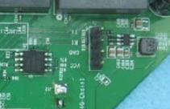


Searching about the model MT7628NN online we find that the CPU is MIPS architecture
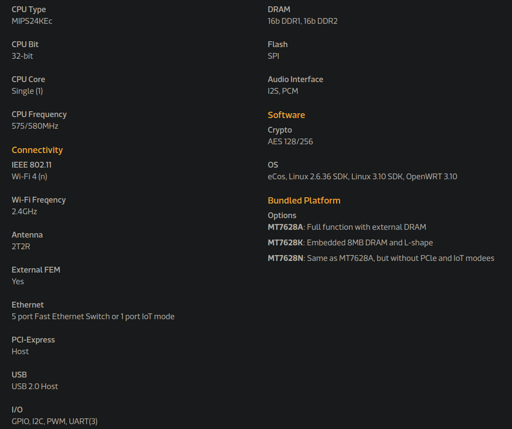


# UART
Opening up the TP-LINK TL-WR841N and taking a look at the PCB we see the MCU model and the UART port we already discovered from fccid.

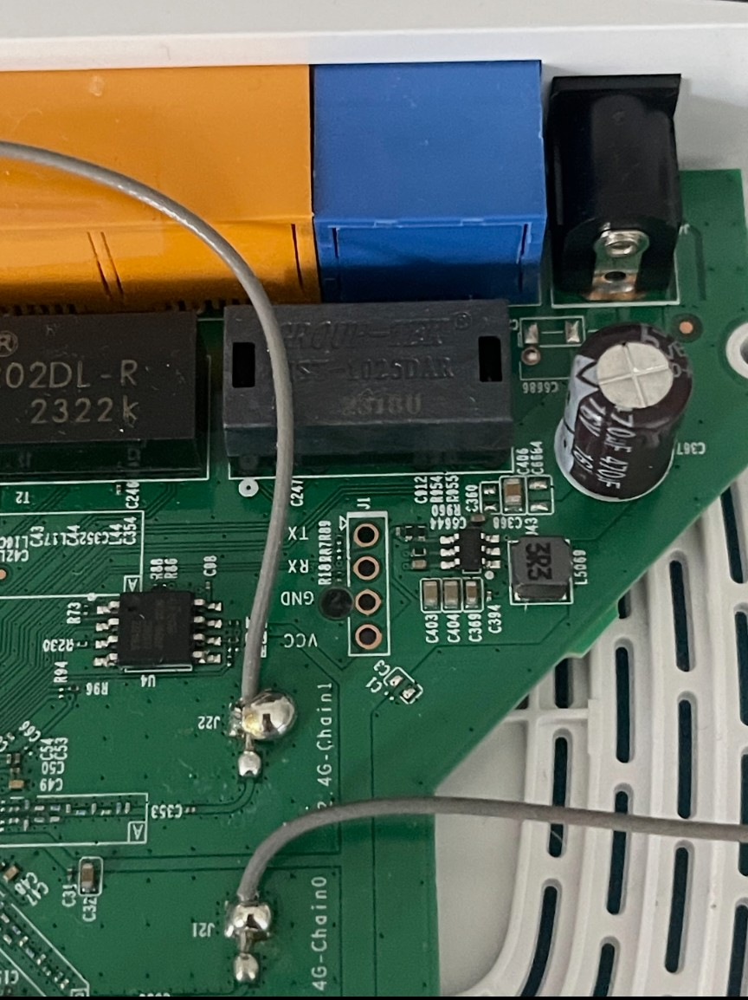

 Using a TTL to usb converter we can connect the RX and TX of the UART with a computer and using minicom or picocom with the USB device that connects to the UART we can interface with it.
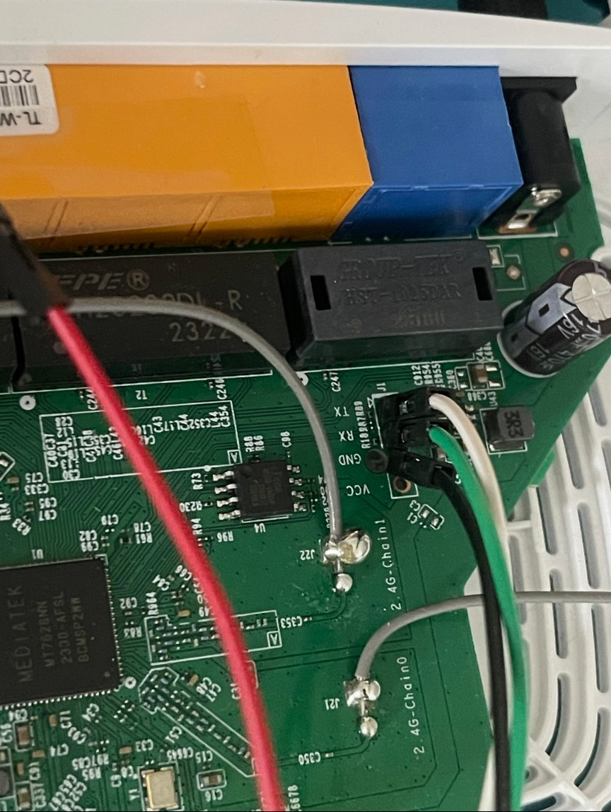
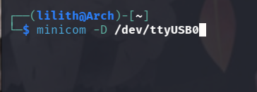

The UART has no authentication and doesn't place you in a restrictive shell or any sandbox environment. Instead we are greeted with a root shell.

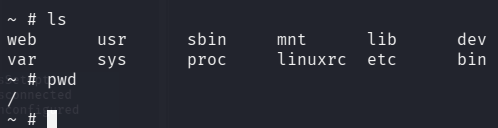

Our regular computers have binaries for each Unix command that we use, ls, pwd, id, whoami, etc.
On embedded devices things are different. There are many hardware limitation and developers need to be more careful about the resources used.
Busybox is a single binary that can be configured to only have the commands that your embedded device needs.

In our case the busybox that they included is very restrictive and limiting. 
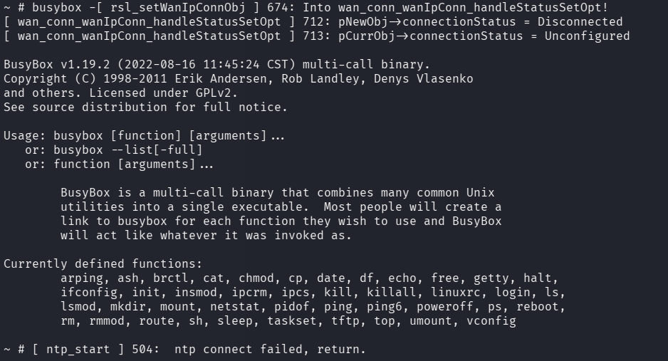

If we had a way to transfer files to the device over the network we could upload a busybox binary that includes a lot more commands and make our exploitation a lot easier. Thats where tftpd comes in, but more on that later.

Usually in embedded devices not every directory is writable. We would need to identify the location of any volatile memory.

Using the "mount" command (luckily busybox includes it) we can see that the `/var` uses ramfs which means that this will be the partition where we can drop our binaries.

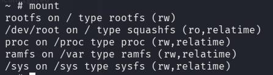

But before that, lets enumerate and see what we got.

## Enumeration
Enumerating the various directories and files in the system we come across the hash for the administrator (hardcoded credentials) and the default wifi password.

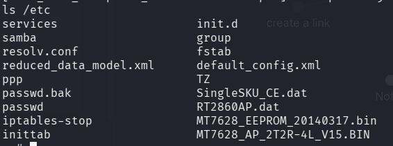

The contents of passwd file:


the contents of RT2860AP.dat file:


The network services that are running and on which port.
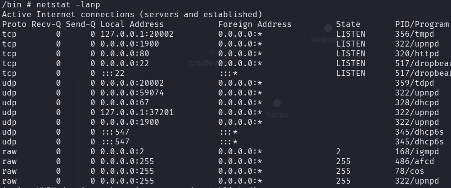

Taking a look under the `/var` directory we find a lot of interesting files such as a dropbear key and the upnp configuration files.
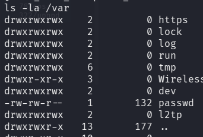

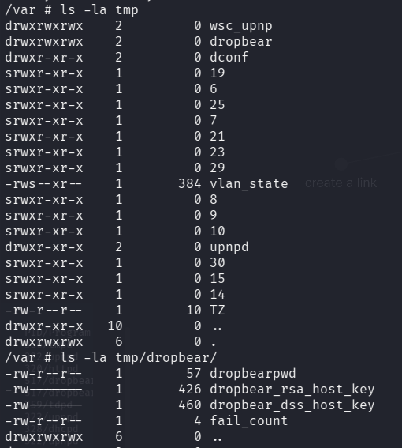


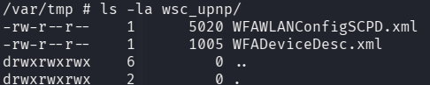

## Upload
From our enumeration we saw that the default busybox had a command called tftpd.

Looking at the documentation for tftp online we see that we cant transfer files to and from the router.
More specifically by using the "g" flag we can "get" a (r)emote file from our computer, to the router device.

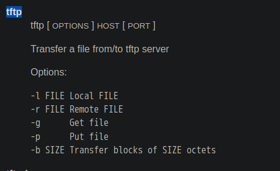

Back in our computer we initialize the tftp service and move the desired file that we want to upload to the `/var/lib/tftpboot` directory.
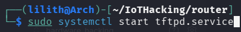
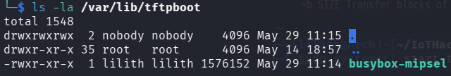

Note that we do need to use the right busybox for our architecture, in our case its mips as we found out from our [OSINT](#OSINT).

In our UART shell we need to provide the name of the file we want to "get" and the IP of the host to get it from.


We can also use the "p" flag to "put" a (l)ocal file to another device, again, our host, which allows us to transfer the dropbear rsa key to our computer.

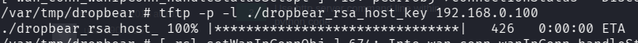

Finally we can use our new busybox binary with all the typical Unix commands we know and love
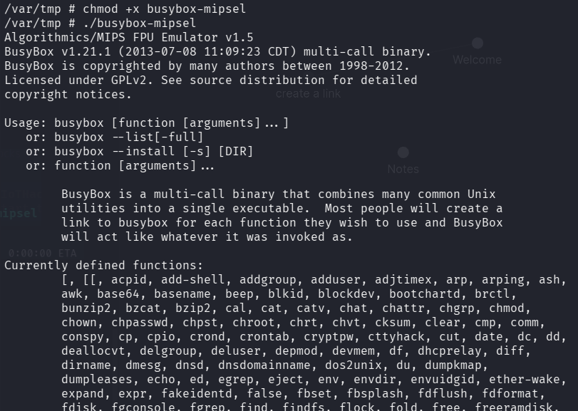

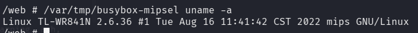


## Backdoor
We can set up a [bind_shell](https://github.com/lilithgkini/Malware_Development/blob/main/Bind_Shell) for persistence on the device. 

Since we are working with mipsel we need to compile it for that architecture


Then we can upload the backdoor binary to the router via tftp.
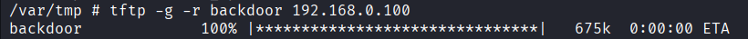

run `chmod +x backdoor` and execute it.
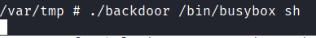

Finally back in our machine we can use netcat to connect to the target and get a shell.
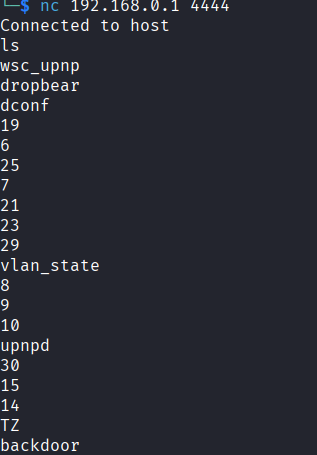

# Firmware Dumping
Another thing we haven't mentioned so far is the EEPROM right next to the UART.
Taking a closer look we see that it says "cFeon Q32B-104".
Searching online we come across the [data sheet](https://www.alldatasheet.com/datasheet-pdf/pdf/458184/EON/EN25Q32B-104HIP.html) for this model which tells us that It's communicating with the MCU via SPI bus and shows us exactly which parts are the MISO, MOSI, clock and chip select.

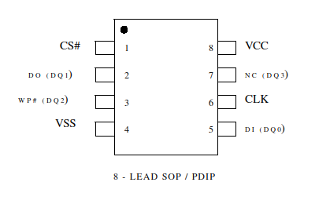

Connecting our test hooks with the appropriate legs and to a raspberry pi pico (you can use any microcontroller you prefer, as long as you load it with the right script to read the flash) we can dump the firmware by running 
```bash
sudo flashrom -p serprog:dev=/dev/ttyACM0,spispeed=104000 -c W25Q64BV/W25Q64CV/W25Q64FV -r firmware.bin
```
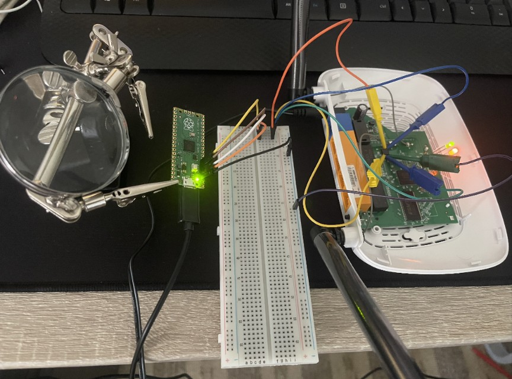


# Static Analysis
Once the process finishes we can use binwalk to extract the filesystem and analyze it.
```bash
binwalk firmware.bin
cd _firmware.bin.extracted
```

Listing all the files we see the passwd file with the hash of the admin and also the RT2860AP.dat that has the default password for the WiFi, just like we saw in the UART shell.

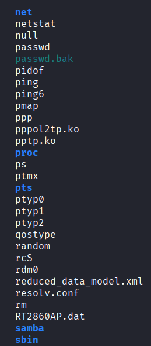

Running file on the busybox binary we can see again that the architecture is MIPS Least Significant Byte.
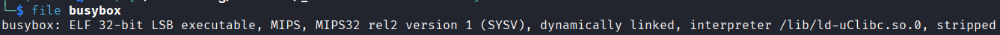
